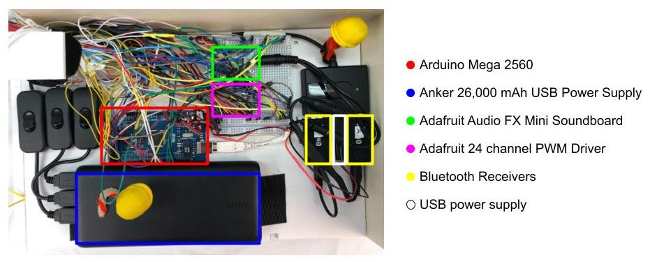

# 
Hotel Worme is an Arduino controlled automated miniature immersive theater project. Two users put on headphones and experience a 15 minute original story voiced by actors with sound effects and original score. 

LEDs guide the user to the next scene.

Characters are controlled by servos.

A short Wormy World intermission.

Hotel Worme is no longer with us, but you can view the

[Full Video](https://vimeo.com/manage/videos/865836759)

